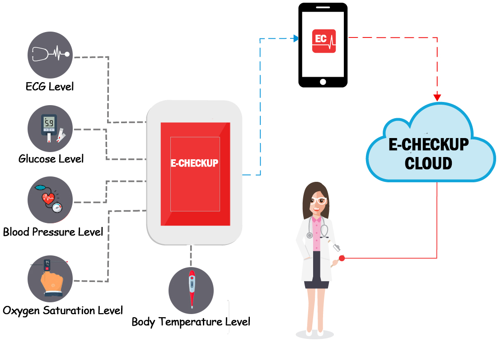

[comment]: # "This is the standard layout for the project, but you can clean this and use your own template"

# E Checkup

---

## Team
-  E/15/366, THINESH S., [sathathinesh@gmail.com](mailto:sathathinesh@gmail.com)
-  E/15/373, VAHEESAN R., [waga950924@gmail.com](mailto:waga950924@gmail.com)
-  E/15/330, SATHURSAN K., [wdeva22@gmail.lk](mailto:wdeva22@gmail.lk)

## Table of Contents
1. [Introduction](#introduction)
2. [Solution Architecture](#solution-architecture )
3. [Hardware & Software Designs](#hardware-and-software-designs)
4. [Links](#links)

---

## Introduction

This project is about making an online interface for routine medical checkups. Usually people are not happy with standing in a queue or waiting a long time in the hospital to see the doctor as well as doctors also need a most efficient and effective way to examine their patients. Mostly in routine medical checkups doctor needs a data of several biometric parameters of patient’s body. These data can be measured by some sensors and stored through our system.

[Intro](docs/data/videos/CO321_Animation.mp4)

## Solution Architecture

This system allows you to measure biometric parameters such as pulse, breath rate, oxygen in blood, electrocardiogram signals, blood pressure, glucose levels. This information is used to monitor in real time the state of a user or to get sensitive data in order to be subsequently analyzed for medical diagnosis. Biometric information gathered can be wirelessly sent to the server and stored there , the data can be visualized in a tablet or smart phone by the patient thereafter the patient can send those data to doctor. The doctors can analyze those data and provide feedback to patients.

## Hardware and Software Designs  
### Data Flow of System  
  
    
#### [Web Application Demonstration](docs/data/WebApp.mp4)

## Links  
### Documents
- [Project Report](docs/data/documents/pro_report.pptx)
- [Project Proposal](docs/data/documents/ProjectProposal.docx)  
### Other Links  

- <a href = "https://github.com/cepdnaclk/e15-3yp-E-Checkup" target = "_blank"> Project Repository </a>
- <a href = "https://cepdnaclk.github.io/e15-3yp-E-Checkup/" target = "_blank">Project Page</a>
- <a href = "http://www.ce.pdn.ac.lk/" target = "_blank">Department of Computer Engineering</a>
- <a href = "https://eng.pdn.ac.lk/" target = "_blank">University of Peradeniya</a>

[//]: # (Please refer this to learn more about Markdown syntax)
[//]: # (https://github.com/adam-p/markdown-here/wiki/Markdown-Cheatsheet)
